<h1 align="center">🤖 Robot Pemadam Api Wall Follower</h1>
<p align="center"><em>Navigasi Otonom dengan Deteksi dan Pemadaman Api Cerdas</em></p>

<p align="center">
  
  
  
  
</p>

---

## 📋 Daftar Isi

1. [Gambaran Proyek](#-gambaran-proyek)
2. [Fitur Utama](#-fitur-utama)
3. [Flowchart Sistem](#-flowchart-sistem)
4. [Komponen Hardware](#-komponen-hardware)
5. [Persyaratan Software](#-persyaratan-software)
6. [Instalasi](#-instalasi)
7. [Konfigurasi Pin](#-konfigurasi-pin)
8. [Cara Penggunaan](#-cara-penggunaan)
9. [Parameter Konfigurasi](#-parameter-konfigurasi)
10. [Troubleshooting](#-troubleshooting)
11. [Kontribusi](#-kontribusi)
12. [Lisensi](#-lisensi)

---

## 🧠 Gambaran Proyek

Robot ini adalah sistem navigasi otonom yang menggabungkan dua fungsi utama:

- **🔄 Wall Following**: Navigasi mengikuti dinding menggunakan sensor ultrasonik dengan scanning servo
- **🔥 Fire Fighting**: Deteksi dan pemadaman api otomatis menggunakan sensor flame dan pompa air

Robot menggunakan **state machine** dengan tiga mode operasi:
1. `WALL_FOLLOWING` - Mode navigasi normal
2. `FIRE_DETECTED` - Mode deteksi dan pendekatan api  
3. `FIRE_FIGHTING` - Mode pemadaman api aktif

---

## ✨ Fitur Utama

### 🚶‍♂️ Navigasi Wall Following
- Deteksi dinding menggunakan sensor ultrasonik HC-SR04
- Scanning 180° dengan servo untuk mencari jalur terbuka
- Algoritma pengambilan keputusan berdasarkan jarak terjauh
- Hindari tabrakan dengan mundur otomatis

### 🔥 Sistem Firefighting
- **3 sensor flame** (kiri, depan, kanan) untuk deteksi 360°
- **Deteksi bertingkat**: Terpantau → Mendekati → Sangat Dekat
- **Navigasi menuju api** dengan logika sensor diferensial
- **Pemadaman otomatis** dengan pompa dan servo penyemprot
- **Kembali ke navigasi** setelah api padam

### 🎛️ Kontrol Motor
- Motor driver L298N untuk 2 motor DC
- Fungsi: Maju, Mundur, Belok Kiri, Belok Kanan, Stop
- Koreksi kecepatan untuk gerakan lurus

---

## 📊 Flowchart Sistem

```mermaid
flowchart TD
    A[🚀 START] --> B[📡 Baca Sensor Flame]
    B --> C{🔥 Api Terdeteksi?}
    
    C -->|Tidak| D[🔄 Mode: WALL_FOLLOWING]
    C -->|Ya| E[🔥 Mode: FIRE_DETECTED]
    
    D --> D1[📏 Baca Sensor Ultrasonik]
    D1 --> D2{Jarak < 27cm?}
    D2 -->|Ya| D3[⬅️ Mundur]
    D2 -->|Tidak| D4{Jarak > 30cm?}
    D4 -->|Ya| D5[⬆️ Maju]
    D4 -->|Tidak| D6[🔍 Mulai Scanning]
    
    D6 --> D7[🔄 Servo Scan: 45°-110°-180°]
    D7 --> D8[📊 Pilih Jarak Terjauh]
    D8 --> D9{Arah Terbaik?}
    D9 -->|Kiri| D10[↩️ Belok Kiri]
    D9 -->|Kanan| D11[↪️ Belok Kanan]
    D9 -->|Tengah| D12[⬆️ Maju]
    
    D3 --> B
    D5 --> B
    D10 --> B
    D11 --> B
    D12 --> B
    
    E --> E1{🔥 Api Sangat Dekat?<br/>Front < 744}
    E1 -->|Ya| E2[💧 Aktifkan Pompa]
    E2 --> E3[🔄 Servo Kiri-Kanan]
    E3 --> E4[⏱️ Semprot 1 detik]
    E4 --> B
    
    E1 -->|Tidak| E5{🔥 Api Mendekati?<br/>< 950}
    E5 -->|Ya| E6[🎯 Arahkan ke Api]
    E6 --> E7{Sensor Mana?}
    E7 -->|Kiri| E8[↩️ Belok Kiri]
    E7 -->|Kanan| E9[↪️ Belok Kanan]
    E7 -->|Seimbang| E10[⬆️ Maju ke Api]
    
    E8 --> B
    E9 --> B
    E10 --> B
    
    E5 -->|Tidak| E11[✅ Api Padam]
    E11 --> E12[🔄 Kembali Wall Following]
    E12 --> B
    
    style A fill:#e1f5fe
    style E2 fill:#ffebee
    style E11 fill:#e8f5e8
    style D fill:#f3e5f5
```



---

## 🧰 Komponen Hardware

### Sensor & Aktuator
| Komponen | Model | Pin | Fungsi |
|----------|-------|-----|--------|
| Sensor Ultrasonik | HC-SR04 | 4 (TRIG), 8 (ECHO) | Deteksi jarak dinding |
| Servo Motor | SG90 | 9 (PWM) | Scanning sensor |
| Sensor Flame Kiri | - | A4 (Analog) | Deteksi api kiri |
| Sensor Flame Depan | - | A5 (Analog) | Deteksi api depan |
| Sensor Flame Kanan | - | A3 (Analog) | Deteksi api kanan |
| Relay Pompa | - | A2 (Digital) | Kontrol pompa air |

### Motor & Driver
| Komponen | Pin | Fungsi |
|----------|-----|--------|
| Motor Driver ENA | 11 (PWM) | Enable motor kanan |
| Motor Driver IN1 | 12 | Kontrol motor kanan |
| Motor Driver IN2 | 13 | Kontrol motor kanan |
| Motor Driver ENB | 5 (PWM) | Enable motor kiri |
| Motor Driver IN3 | 6 | Kontrol motor kiri |
| Motor Driver IN4 | 7 | Kontrol motor kiri |

### Komponen Tambahan
- Arduino Uno/Nano
- Chassis robot dengan 2 roda + 1 caster wheel
- Battery pack 12V untuk motor
- Battery pack 5V untuk Arduino
- Pompa air mini + selang
- Kabel jumper & breadboard

---

## 💻 Persyaratan Software

- **Arduino IDE** (versi 1.8.0 atau lebih baru)
- **Library Arduino**:
  - `Servo.h` (built-in)
  - `NewPing.h` - [Install dari Library Manager]

### Instalasi Library
1. Buka Arduino IDE
2. `Sketch` → `Include Library` → `Manage Libraries`
3. Cari "NewPing" → Install
4. Restart Arduino IDE

---

## ⚙️ Instalasi

### 1. Persiapan Hardware
```bash
# Clone repository
git clone https://github.com/ficrammanifur/robot-wall-folower.git
cd robot-wall-folower
```

### 2. Wiring Hardware
Ikuti diagram wiring sesuai tabel pin di atas. Pastikan:
- Power supply terpisah untuk motor (12V) dan Arduino (5V)
- Ground semua komponen terhubung
- Sensor flame menghadap ke arah yang benar

### 3. Upload Code
1. Buka `FINAL.ino` di Arduino IDE
2. Pilih board: `Tools` → `Board` → `Arduino Uno`
3. Pilih port: `Tools` → `Port` → (pilih port Arduino)
4. Upload: `Sketch` → `Upload` atau Ctrl+U

---

## 🔧 Konfigurasi Pin

```cpp
// Sensor Ultrasonik
#define TRIG_PIN 4
#define ECHO_PIN 8

// Motor Driver
#define MOTOR_ENA 11  // Motor kanan (PWM)
#define MOTOR_IN1 12  // Motor kanan
#define MOTOR_IN2 13
#define MOTOR_ENB 5   // Motor kiri (PWM)  
#define MOTOR_IN3 6   // Motor kiri
#define MOTOR_IN4 7

// Sensor Flame
#define FLAME_LEFT_PIN   A4
#define FLAME_FRONT_PIN  A5
#define FLAME_RIGHT_PIN  A3

// Relay Pompa
#define PUMP_RELAY_PIN   A2

// Servo
// Pin 9 (didefinisikan dalam kode)
```

---

## 🚀 Cara Penggunaan

### 1. Persiapan Awal
- Pastikan semua koneksi hardware benar
- Charge/pasang battery
- Letakkan robot di area dengan dinding untuk wall following

### 2. Menjalankan Robot
1. Upload code ke Arduino
2. Buka Serial Monitor (9600 baud) untuk monitoring
3. Power ON robot
4. Robot akan mulai dengan mode wall following

### 3. Monitoring
Serial Monitor akan menampilkan:
```
=== ROBOT PEMADAM API WALL FOLLOWER ===
Flame - Left: 1023 | Front: 1020 | Right: 1018
Mode: WALL FOLLOWING
Jarak Depan: 45
Jalan bebas - Maju
```

### 4. Testing Mode
- **Wall Following**: Robot navigasi mengikuti dinding
- **Fire Detection**: Dekatkan api/lighter ke sensor flame
- **Fire Fighting**: Robot akan mendekati dan memadamkan api

---

## ⚙️ Parameter Konfigurasi

### Threshold Sensor Flame
```cpp
#define API_TERPANTAU      1014  // Tidak ada api jika > ini
#define API_MENDEKATI       950  // Ada api jika < 950  
#define API_DEPAN_DEKAT     744  // Api sangat dekat jika < 744
#define SENSOR_TOLERANCE    30   // Toleransi sensor kiri-kanan
```

### Threshold Ultrasonik
```cpp
#define MAX_DISTANCE 200      // Jarak maksimum sensor (cm)
#define WALL_THRESHOLD 30     // Threshold dinding terdeteksi
#define STOP_DISTANCE 27      // Jarak stop untuk mundur
```

### Kecepatan Motor
```cpp
#define SPEED 100             // Kecepatan dasar motor (0-255)
// Motor kanan: SPEED + 3    // Koreksi untuk gerakan lurus
```

### Posisi Servo
```cpp
const int SERVO_KANAN = 40;   // Posisi servo kanan (derajat)
const int SERVO_KIRI  = 180;  // Posisi servo kiri  
const int SERVO_DEPAN = 110;  // Posisi servo depan (tengah)
```

---

## 🔧 Troubleshooting

### Robot Tidak Bergerak
- ✅ Cek koneksi motor driver
- ✅ Cek power supply motor (12V)
- ✅ Cek kode pin motor di Arduino

### Sensor Ultrasonik Tidak Akurat
- ✅ Cek koneksi TRIG (pin 4) dan ECHO (pin 8)
- ✅ Pastikan sensor tidak terhalang
- ✅ Cek library NewPing terinstall

### Sensor Flame Tidak Responsif
- ✅ Cek nilai analog di Serial Monitor
- ✅ Sesuaikan threshold sesuai kondisi cahaya
- ✅ Pastikan sensor menghadap ke arah yang benar

### Servo Tidak Bergerak
- ✅ Cek koneksi servo ke pin 9
- ✅ Cek power supply servo (5V)
- ✅ Cek library Servo.h

### Pompa Tidak Menyala
- ✅ Cek koneksi relay ke pin A2
- ✅ Cek power supply pompa
- ✅ Pastikan relay NO (Normally Open)

---

## 🤝 Kontribusi

Kontribusi sangat diterima! Untuk berkontribusi:

1. **Fork** repository ini
2. **Create branch**: `git checkout -b feature/amazing-feature`
3. **Commit**: `git commit -m 'Add amazing feature'`
4. **Push**: `git push origin feature/amazing-feature`
5. **Pull Request**: Buat PR dengan deskripsi lengkap

### Area Pengembangan
- [ ] Implementasi PID control untuk navigasi
- [ ] Tambah sensor IMU untuk orientasi
- [ ] Wireless monitoring via WiFi/Bluetooth
- [ ] Machine learning untuk path optimization
- [ ] Multiple fire source detection

---

## 📝 Lisensi

Proyek ini dilisensikan di bawah [MIT License](LICENSE).

```
MIT License

Copyright (c) 2024 ficrammanifur

Permission is hereby granted, free of charge, to any person obtaining a copy
of this software and associated documentation files (the "Software"), to deal
in the Software without restriction, including without limitation the rights
to use, copy, modify, merge, publish, distribute, sublicense, and/or sell
copies of the Software, and to permit persons to whom the Software is
furnished to do so, subject to the following conditions:

The above copyright notice and this permission notice shall be included in all
copies or substantial portions of the Software.
```

---

## 📞 Kontak

**Pengembang**: [ficrammanifur](https://github.com/ficrammanifur)

- 🐛 **Bug Reports**: [Issues](https://github.com/ficrammanifur/robot-wall-folower/issues)
- 💡 **Feature Requests**: [Discussions](https://github.com/ficrammanifur/robot-wall-folower/discussions)
- 📧 **Email**: [Buka profil GitHub](https://github.com/ficrammanifur)

---

<p align="center">
  <strong>🤖 Happy Robotics! 🔥</strong><br>
  <em>Dibuat dengan ❤️ untuk komunitas robotika Indonesia</em>
</p>

<p align="center">
  <a href="#top">⬆️ ⬆ Back on Top</a>
</p>

